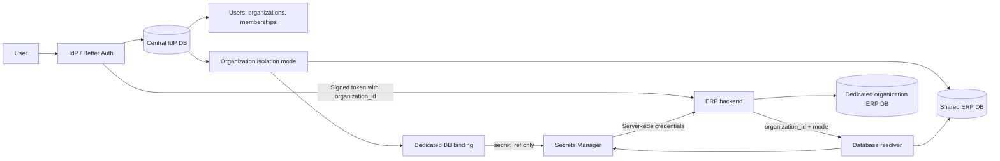

# Organization-Aware ERP with Shared or Dedicated Databases per Organization

## Purpose

This document describes how to extend this Identity Provider (IdP) so one ERP application can serve many organizations while allowing each organization to use either a shared ERP database or its own dedicated database when stronger data isolation is required.

The intended product model is:

- Customers use our domain and our ERP application.
- Users authenticate through this IdP.
- A user may belong to more than one organization.
- The user selects an organization before entering the ERP.
- The ERP receives organization identity as authorization context.
- The ERP backend routes the request to the correct organization database.
- Database credentials never reach the browser, OAuth token, or ordinary organization metadata.
- Each organization has an explicit deployment mode: `shared` or `dedicated`.

This is an architecture plan, not an implementation checklist that has already been applied.

## Executive decision

Use a two-plane architecture with an explicit isolation mode for every organization:

1. **Identity/control plane**
   - Shared IdP PostgreSQL database.
   - Stores users, organizations, memberships, roles, OAuth clients, sessions, and deployment configuration.
   - Does not store tenant ERP records.

2. **Shared data-plane mode**
   - Multiple organizations use one configured ERP database.
   - Every tenant-owned row carries `organization_id`.
   - Application authorization and PostgreSQL row-level security (RLS) prevent cross-organization reads and writes.

3. **Dedicated data-plane mode**
   - One organization uses its own ERP database.
   - The ERP backend resolves that organization to a server-side secret reference and database connection.

The ERP should identify a tenant using a verified `organization_id` claim, read the organization’s trusted isolation mode, and route the request through the corresponding data-plane adapter.



## Why this fits the repository

The repository already provides the identity foundation:

- `packages/auth/src/index.ts` configures Better Auth, the OAuth Provider, JWTs, admin roles, two-factor authentication, audit hooks, and revocation behavior.
- `packages/db/src/schema/auth.ts` already contains OAuth client, consent, access-token, and refresh-token records.
- OAuth token and consent records already have a `referenceId` field that can carry organization context.
- `packages/types/src/index.ts` is the shared contract used by relying parties and resource servers.
- `apps/test-rp` demonstrates the authorization-code and token-verification flow.

Better Auth’s Organization plugin supplies organization membership and organization-level authorization. It does not provision tenant databases, manage connection pools, run tenant migrations, or replace a secrets manager.

References:

- [Better Auth Organization plugin](https://www.better-auth.com/docs/plugins/organization)
- [Better Auth OAuth 2.1 Provider](https://www.better-auth.com/docs/plugins/oauth-provider)
- [OWASP Secrets Management Cheat Sheet](https://cheatsheetseries.owasp.org/cheatsheets/Secrets_Management_Cheat_Sheet.html)
- [RFC 7519: JSON Web Token](https://www.rfc-editor.org/rfc/rfc7519.html)

## Core terminology

### Identity Provider

The IdP authenticates users and issues tokens. In this repository, it is the `apps/web` Next.js application backed by `packages/auth` and `packages/db`.

### Relying Party

An application that trusts the IdP. In the target design, the ERP is the main relying party.

### Organization

A customer or tenant. It owns membership, organization roles, ERP data, and application access.

### Control plane

The shared administrative system that knows which organizations exist and how they are configured.

### Data plane

The data plane is either a shared ERP database protected by tenant scoping and RLS or an organization-specific dedicated ERP database.

### Database binding

A non-secret record that describes an organization’s isolation mode and, for dedicated mode, points to its ERP database profile.

### Isolation mode

Each organization has an `isolation_mode` value:

- `shared`: route to the configured shared ERP database. Tenant-owned tables must contain `organization_id`, and access must be constrained by application authorization plus PostgreSQL RLS.
- `dedicated`: route to that organization’s own ERP database through a server-side secret reference.

The mode is trusted control-plane configuration. It must not be selected from a browser parameter or copied from an unverified token field. A platform administrator or provisioning service changes it through an audited operation.

## Organization and database model

For the single-ERP-app case, keep one deployment record per organization:

```text
organization_id → isolation_mode → selected data plane
```

The resolver behaves differently by mode:

```text
shared:
  organization_id → configured shared ERP database

dedicated:
  organization_id → dedicated database binding → secret manager → ERP database
```

A future multi-application version should use:

```text
(organization_id, oauth_client_id) → isolation mode and application database profile
```

Using the application ID now is optional, but it prevents a later redesign if more first-party applications are added.

### Control-plane table

The exact table name can follow repository conventions. A possible design is:

```text
organization_database_binding
────────────────────────────────────────
id
organization_id       unique foreign key
application_id        nullable initially, required later
isolation_mode        shared | dedicated
secret_ref            nullable for shared, required for dedicated
database_profile      non-secret configured profile name
database_label        safe display label
region                deployment region
status                provisioning status
schema_version        last applied ERP schema version
created_at
updated_at
```

Recommended constraints:

- `organization_id` must reference an existing organization.
- `organization_id` must be unique for the single-ERP-app model.
- `isolation_mode` must be an allowlisted enum.
- `shared` records must use an allowlisted shared `database_profile` and must not contain tenant credentials.
- `dedicated` records must have a non-empty `secret_ref`.
- An organization cannot enter the ERP unless its deployment status is `active`.
- Database binding and isolation-mode changes must be audited.

Do not use free-form organization metadata for this binding. Better Auth metadata is useful for ordinary organization properties, but database routing is security-sensitive infrastructure configuration and deserves a typed table with constraints.

## Secret handling

The control-plane database should store a reference such as:

```text
tenants/org_123/apps/erp/database
```

The referenced secret may contain:

```json
{
  "host": "db.internal.example",
  "port": 5432,
  "database": "erp_org_123",
  "username": "erp_org_123_app",
  "password": "stored-in-secret-manager",
  "sslMode": "verify-full"
}
```

The following must not be returned to the browser or placed in a token:

- database password;
- database username;
- connection string;
- private network address;
- secret-manager contents;
- credentials for another application’s database.

The IdP should ideally not have permission to read ERP database passwords. The ERP backend should resolve its own secrets using its workload identity, with access limited to the ERP tenant secret namespace.

If a secret manager is unavailable, the ERP should fail closed for requests requiring tenant data. It should not fall back to a default database.

## Authentication and organization selection

### IdP-driven selection

The recommended login flow is:

1. The ERP starts an OAuth/OIDC authorization request.
2. The user signs in at the IdP.
3. The IdP lists organizations where the user is a member.
4. If there is one organization, the IdP may select it automatically.
5. If there are multiple organizations, the IdP displays an organization selector.
6. The user selects one organization.
7. The IdP validates membership and application access.
8. The OAuth flow continues to consent or directly to the callback.
9. The ERP receives a token bound to exactly one organization.

The local Better Auth OAuth Provider documentation describes this pattern using `postLogin`, `organization.setActive`, and `oauth2Continue`.

The active organization is a selection convenience. The authorization transaction must also bind the organization through the OAuth provider’s reference data, such as `consentReferenceId`, so the final code and tokens cannot silently switch to another organization.

### ERP-initiated switching

The ERP may display an organization switcher after login. Switching must start a new organization-selection or authorization transaction:

```text
ERP switcher
    ↓
new authorization request
    ↓
IdP validates membership and selected organization
    ↓
new organization-scoped token
    ↓
ERP changes its local session context
```

The ERP must not switch tenants by changing a browser variable or trusting an unverified `organization_id` request parameter.

An existing token for Organization A must not be reused to access Organization B. A new token is required.

## Token contract

The ERP access token should contain authorization context, not infrastructure secrets.

Illustrative claims:

```json
{
  "iss": "https://idp.example.com/api/auth",
  "sub": "user_123",
  "azp": "erp_client_id",
  "scope": "openid profile email erp:read",
  "https://idp.example.com/claims/organization_id": "org_123",
  "https://idp.example.com/claims/organization_roles": ["member"],
  "jti": "token_123",
  "exp": 1770000000
}
```

Use a collision-resistant namespace for custom claims. Update `packages/types/src/index.ts` so relying parties can validate the organization claim after cryptographic verification.

The ERP backend must verify:

- token signature using discovered JWKS;
- issuer;
- audience;
- expiration;
- required scopes;
- `azp` equals the ERP client ID;
- organization claim is present and valid;
- organization binding is active.

A token claim is not a database credential and is not sufficient by itself to establish a database connection.

## Role model

Keep global IdP roles separate from organization membership roles.

### Global IdP roles

These already exist in `packages/auth/src/permissions.ts`:

- `admin`: platform-wide operator;
- `moderator`: current account-lifecycle operator;
- `user`: ordinary IdP user.

### Organization roles

Add a separate organization role model:

- `owner`: full organization control;
- `admin`: organization administration;
- `org_moderator`: safe organization metadata and ordinary-member management;
- `member`: ordinary organization membership.

An `org_moderator` should not automatically receive platform-wide moderator rights.

Recommended organization moderator rules:

- may view organization members;
- may remove ordinary members;
- may edit an allowlisted set of organization display fields;
- may not remove the last owner;
- may not remove owners, organization admins, or other moderators;
- may not assign platform roles;
- may not edit database bindings or secret references;
- may not change database credentials;
- may not delete an organization.

The Better Auth permission system provides broad organization and member operations. Add server-side guards for target hierarchy and field allowlists, similar to the existing global admin guards.

## ERP request-to-database flow

Every tenant data request should follow this sequence:

```text
1. Receive request at ERP backend.
2. Read bearer token or local ERP session.
3. Verify the token cryptographically.
4. Obtain the signed organization_id.
5. Confirm the token belongs to this ERP application.
6. Resolve organization_id to the ERP binding.
7. Confirm binding status is active.
8. Resolve secret_ref using the ERP service identity.
9. Reuse or create a bounded database connection pool.
10. Execute the request through the selected shared or dedicated data plane.
```

The browser should never select a database host or connection string.

Do not trust only:

```http
X-Organization-Id: org_123
```

If an organization header is used for routing, it must match the verified token claim. The token claim is the authorization source; the header is only a routing hint.

## Data-plane provisioning lifecycle

Creating an organization and preparing its data plane are separate operations.

### Shared mode

1. Create the organization deployment record with `isolation_mode = shared`.
2. Confirm the configured shared ERP database exists and is reachable.
3. Confirm tenant-owned tables contain `organization_id`.
4. Apply and test RLS policies using an application role that does not own the tables and does not bypass RLS.
5. Run cross-organization isolation checks.
6. Mark the deployment `active` only after all checks pass.

### Dedicated mode

1. Create the organization deployment record with `isolation_mode = dedicated`.
2. Create the organization’s ERP database.
3. Create an application-specific least-privilege database user.
4. Apply the ERP schema.
5. Store credentials in the secrets manager.
6. Create the non-secret binding record.
7. Perform a TLS-verified health check.
8. Mark the deployment `active` only after all checks pass.

Recommended states:

```text
pending
provisioning
migrating
active
failed
suspended
archived
```

The operation must be idempotent and resumable. A failed provisioning attempt must not leave an organization incorrectly marked as ready.

### Changing modes

Changing an organization from `shared` to `dedicated` requires a controlled data migration:

1. provision the dedicated database;
2. copy only that organization’s data;
3. validate row counts, checksums, and application invariants;
4. briefly stop or serialize writes for cutover;
5. switch the audited deployment record;
6. verify the ERP routes new requests to the dedicated database;
7. retain or archive the old shared rows according to the retention policy.

The reverse operation requires the same care. Do not change `isolation_mode` as a simple settings update while requests are in flight.

## Connection-pool requirements

Dedicated mode creates many possible pools. Shared mode generally uses fewer pools, but every request still requires organization scoping and must never fall back to another tenant.

The connection manager should provide:

- maximum active pool count;
- idle pool eviction;
- connection and query timeouts;
- TLS certificate verification;
- per-tenant circuit breakers;
- metrics by organization and database profile;
- safe pool shutdown during secret rotation;
- no fallback to another organization’s database.

A managed database proxy or PgBouncer may be appropriate as the tenant count grows.

## Removing organization members

Removing a member should not necessarily sign them out of every organization.

The organization removal path should:

1. remove the membership;
2. audit actor, target, organization, and reason;
3. revoke organization-scoped refresh tokens;
4. revoke or delete organization-scoped opaque access tokens;
5. clear the removed organization from the user’s active session if necessary;
6. prevent new tokens from being issued for that organization;
7. notify organization administrators if required.

JWTs already issued to the user cannot all be invalidated by deleting a membership if resource servers verify them locally. Use the repository’s risk-based token modes:

- ordinary routes accept short-lived tokens until expiry;
- sensitive routes perform a live organization-membership/status check;
- refresh-token issuance is denied after membership removal.

Extend `packages/auth/src/revocation-status.ts` and the shared request/response types so high-risk resource servers can validate organization membership as part of the authoritative status check.

## Implementation phases

### Phase 1: Organization foundation

- Add Better Auth’s Organization plugin.
- Add the organization client plugin.
- Generate and review organization schema.
- Add the organization migration.
- Add static organization roles.

### Phase 2: Organization administration

- Add organization selector UI.
- Add member listing and removal UI.
- Add organization metadata editing.
- Add invitation handling.
- Add target and field guards.
- Add audit events.

### Phase 3: Organization-aware OAuth

- Add IdP post-login organization selection.
- Bind the selected organization to the authorization transaction.
- Add namespaced organization token claims.
- Update `packages/types` and integration documentation.
- Add ERP client handling for organization-scoped tokens.

### Phase 4: Tenant data-plane control plane

- Add `organization_database_binding` with `isolation_mode`.
- Add shared-mode profile and RLS validation.
- Add dedicated-mode secret-manager integration.
- Add provisioning states and health checks.
- Add platform-admin-only binding and isolation-mode operations.
- Add database migration status tracking.

### Phase 5: ERP data-plane resolver

- Verify tokens in the ERP backend.
- Resolve the organization’s trusted isolation mode.
- Route shared mode through organization-scoped queries and RLS.
- Resolve dedicated mode through `(organization_id, application_id)` and a secret reference.
- Add bounded connection pooling for dedicated databases.
- Add metrics, timeouts, and failure handling.

### Phase 6: Removal and authorization enforcement

- Revoke organization-scoped refresh and opaque tokens.
- Add organization membership to high-risk status checks.
- Reject new token issuance for removed members.
- Add short-lived token policy for ordinary routes.

### Phase 7: Verification

Use isolated test databases only.

Cover at least:

- a user belonging to two organizations;
- organization selection during OIDC login;
- ERP-initiated organization switching;
- shared mode enforces `organization_id` scoping and RLS;
- dedicated mode routes each organization to its own database;
- missing or inactive deployment records fail closed;
- organization moderators can remove ordinary members;
- organization moderators cannot remove protected roles;
- removing a member blocks refresh;
- sensitive routes reject removed membership immediately;
- ordinary routes follow the documented short-token policy;
- database credentials never appear in browser responses, tokens, or logs;
- provisioning retries are idempotent.

## Current repository touchpoints

Likely implementation areas include:

```text
packages/auth/src/index.ts
packages/auth/src/permissions.ts
packages/auth/src/guards.ts
packages/auth/src/revocation-status.ts
packages/db/src/schema/auth.ts
packages/db/src/schema/tenant-database-binding.ts
packages/db/src/migrations/
packages/types/src/index.ts
apps/web/src/lib/auth-client.ts
apps/web/src/app/
apps/web/src/components/
apps/web/tests/
apps/test-rp/server.ts
apps/test-rp/tests/sso.spec.ts
README.md
INTEGRATION.md
RUNBOOK.md
```

The database binding, secret-manager adapter, connection manager, and ERP data access layer should be designed as separate concerns. Avoid putting all tenant routing logic inside `packages/auth/src/index.ts`.

## Final recommendation

Proceed with explicit per-organization isolation modes. Use `shared` when its isolation and compliance properties are acceptable, and use `dedicated` for organizations requiring stronger database separation.

Keep the IdP responsible for:

- identity;
- organization membership;
- organization roles;
- OAuth authorization;
- signed organization context;
- revocation and audit events.

Keep the ERP platform responsible for:

- database provisioning;
- secrets management;
- database migrations;
- connection pooling;
- tenant data access;
- tenant database health and recovery.

The most important invariant is:

> The user selects an organization, the IdP signs that organization into the authorization context, and the ERP backend independently resolves that context to a server-side database binding. No browser-controlled value or token carries database credentials.
