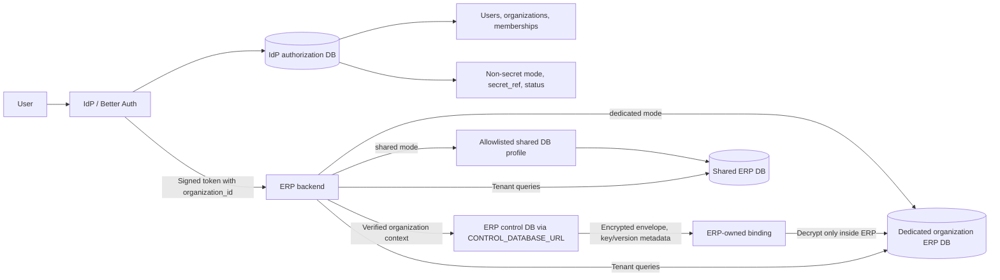

# Organization-Aware ERP with Shared or Dedicated Databases per Organization

## Purpose

This document describes how to extend this Identity Provider (IdP) so one ERP application can serve many organizations while allowing each organization to use either a shared ERP database or its own dedicated database when stronger data isolation is required.

The intended product model is:

- Customers use our domain and our ERP application.
- Users authenticate through this IdP.
- A user may belong to more than one organization.
- The user selects an organization before entering the ERP.
- The ERP receives organization identity as authorization context.
- The ERP backend routes the request to the correct organization database.
- Database credentials never reach the browser, OAuth token, or ordinary organization metadata.
- Each organization has an explicit deployment mode: `shared` or `dedicated`.

This is an architecture plan, not an implementation checklist that has already been applied.

## Executive decision

Use a two-plane architecture with an explicit isolation mode for every organization:

1. **IdP authorization control plane**
   - Shared IdP PostgreSQL database.
   - Stores users, organizations, memberships, roles, OAuth clients, sessions, non-secret binding metadata, and provisioning status.
   - Stores only an opaque `secret_ref` after ERP provisioning; never stores tenant credentials or the ERP encryption key.

2. **ERP credential/data control plane**
   - Separate ERP control database reached through `CONTROL_DATABASE_URL`.
   - Uses a separate Prisma schema/client, not the IdP Drizzle database and not the tenant ERP schema/client.
   - Stores encrypted tenant binding envelopes, key/version metadata, validation state, and rotation state.
   - `be-logiXpair` owns the control client, encryption key, credential validation, rotation, and resolver.

3. **Shared data-plane mode**
   - Multiple organizations use one configured ERP database.
   - Every tenant-owned row carries `organization_id`.
   - Application authorization and PostgreSQL row-level security (RLS) prevent cross-organization reads and writes.

4. **Dedicated data-plane mode**
   - One organization uses its own ERP database.
   - The ERP resolves the verified organization through its ERP control database and creates a bounded tenant pool.

The ERP identifies a tenant from the verified token `organization_id` plus its fixed first-party application ID, queries only its separate ERP control database, and routes through that active control record. IdP binding metadata is used only for token issuance, provisioning correlation, and audit; it is never read in the ERP request-time data path. Before the deliberate full cutover, the target ERP control plane is isolated to fixtures; the legacy runtime remains untouched and is not shadowed or dual-routed.

The first migration implements `dedicated` mode only. `shared` mode remains an intentional future design gated on organization columns, RLS, non-owner database roles, and cross-organization tests; it is not part of the initial cutover.



## Why this fits the repository

The repository already provides the identity foundation:

- `packages/auth/src/index.ts` configures Better Auth, the OAuth Provider, JWTs, admin roles, two-factor authentication, audit hooks, and revocation behavior.
- `packages/db/src/schema/auth.ts` already contains OAuth client, consent, access-token, and refresh-token records.
- OAuth token and consent records already have a `referenceId` field that can carry organization context.
- `packages/types/src/index.ts` is the shared contract used by relying parties and resource servers.
- `apps/test-rp` demonstrates the authorization-code and token-verification flow.

Better Auth’s Organization plugin supplies organization membership and organization-level authorization. It does not provision tenant databases, manage connection pools, run tenant migrations, or replace the ERP control database and encryption boundary.

References:

- [Better Auth Organization plugin](https://www.better-auth.com/docs/plugins/organization)
- [Better Auth OAuth 2.1 Provider](https://www.better-auth.com/docs/plugins/oauth-provider)
- [OWASP Secrets Management Cheat Sheet](https://cheatsheetseries.owasp.org/cheatsheets/Secrets_Management_Cheat_Sheet.html)
- [RFC 7519: JSON Web Token](https://www.rfc-editor.org/rfc/rfc7519.html)

## Core terminology

### Identity Provider

The IdP authenticates users and issues tokens. In this repository, it is the `apps/web` Next.js application backed by `packages/auth` and `packages/db`.

### Relying Party

An application that trusts the IdP. In the target design, the ERP is the main relying party.

### Organization

A customer or tenant. It owns membership, organization roles, ERP data, and application access.

### Control planes

The **IdP authorization control plane** is authoritative for organization membership, roles, application grants, token issuance, and the provisioning/audit status of the opaque binding reference. It stores only non-secret binding metadata and an opaque ERP `secret_ref`; ERP data requests do not read the IdP database or call an implicit IdP resolver.

The **ERP data control plane** is a separate database owned by `be-logiXpair`. Its control record, keyed by the verified organization ID and first-party application ID, is the runtime authority for whether the ERP data plane is active and which encrypted credential-envelope version to use. It is reached through `CONTROL_DATABASE_URL` and a separate Prisma client/schema.

The **data plane** is either a shared ERP database protected by tenant scoping/RLS or an organization-specific dedicated ERP database.

### Database binding

A non-secret IdP record describes an organization’s isolation mode and stores `secret_ref` only as an opaque provisioning correlation/reference to the ERP control binding. It never selects a raw host, path, or connection string, and it is not supplied by the browser or used as the ERP request-time lookup key.

The boundary is deliberately one-way at runtime: the IdP checks its own binding status before issuing an ERP token, while the ERP checks its own control record for every tenant-data request. Provisioning, activation, suspension, and rotation synchronize safe status/version results through an authenticated ERP provisioning boundary; they do not create an ERP-to-IdP database dependency. If the ERP control record is missing, inactive, mismatched, unavailable, or cannot be decrypted/validated, the ERP fails closed.

### Isolation mode

Each organization has an `isolation_mode` value:

- `shared`: route to the configured shared ERP database. Tenant-owned tables must contain `organization_id`, and access must be constrained by application authorization plus PostgreSQL RLS.
- `dedicated`: route to that organization’s own ERP database through a server-side secret reference.

The mode is trusted control-plane configuration. It must not be selected from a browser parameter or copied from an unverified token field. A platform administrator or provisioning service changes it through an audited operation.

## Organization and database model

For the single-ERP-app case, keep one deployment record per organization:

```text
organization_id → isolation_mode → selected data plane
```

The resolver behaves differently by mode:

```text
shared:
  verified organization_id + fixed application_id
    → active ERP control record with allowlisted shared profile
    → shared ERP database with organization scoping and RLS

dedicated:
  verified organization_id + fixed application_id
    → active ERP control record and encrypted envelope version
    → dedicated ERP database
```

A future multi-application version should use:

```text
(organization_id, oauth_client_id) → isolation mode and application database profile
```

The fixed first-party application ID is required now and comes from validated ERP client configuration. Future additional first-party applications reuse the same `(organization_id, application_id)` composite key without a schema redesign.

### IdP organization binding table

The IdP table contains authorization and safe deployment metadata only:

```text
organization_database_binding
────────────────────────────────────────
id
organization_id       foreign key to organization
application_id        required fixed first-party ERP client/application ID
isolation_mode        shared | dedicated
secret_ref            nullable opaque ERP control binding ID
database_profile      non-secret allowlisted shared profile
database_label        safe display label
region                deployment region
status                provisioning status
schema_version        last applied ERP schema version
created_at
updated_at
```

Recommended constraints:

- `(organization_id, application_id)` must be unique; `organization_id` must reference an existing organization and is not unique by itself when the application dimension is present.
- `isolation_mode` must be an allowlisted enum.
- `shared` records must use an allowlisted shared `database_profile` and must not contain tenant credentials or a dedicated `secret_ref`.
- `secret_ref` is absent while `pending`/`provisioning`; `migrating`, `active`, and `suspended` records require a non-empty opaque ERP binding reference. `failed`/`archived` retention or clearing is an audited policy decision.
- An organization cannot enter the ERP unless its deployment status is `active`.
- Database binding and isolation-mode changes must be audited.

Do not use free-form organization metadata for this binding. Better Auth metadata is useful for ordinary organization properties, but database routing is security-sensitive infrastructure configuration and deserves a typed table with constraints.

### ERP control database table

The separate ERP control schema stores parent routing state and versioned credential envelopes, not the IdP database and not the tenant ERP schema:

```text
tenant_database_control_binding
────────────────────────────────────────
binding_id                    immutable opaque correlation ID
organization_id               immutable IdP organization ID
application_id                fixed first-party ERP client/application ID
isolation_mode                dedicated | shared
database_profile              nullable allowlisted shared profile
active_credential_version     nullable CAS pointer to envelope version
status                        pending | provisioning | migrating | active | failed | suspended | archived
health_checked_at
created_at
updated_at
```

```text
tenant_database_credential_envelope
────────────────────────────────────────
binding_id                    foreign key
credential_version            unique within binding
ciphertext                    AES-256-GCM ciphertext; tag stored separately
nonce                         fresh random 96-bit nonce per envelope/version
authentication_tag            separate 128-bit AES-GCM authentication tag
key_id                        encryption-key version
algorithm_version             envelope format version
validation_status             candidate | validated | failed | retired
health_checked_at
created_at
retired_at
```

`be-logiXpair` uses a dedicated `CONTROL_DATABASE_URL` and separate Prisma schema/client for these tables. The control client must never reuse `DATABASE_URL`, the existing tenant Prisma schema, or the legacy `tenant-pool` client.

The ERP control schema enforces a unique `(organization_id, application_id)` runtime key, a unique immutable `binding_id`, and a unique `(binding_id, credential_version)` envelope key. Rotation writes a validated candidate envelope row, then updates `active_credential_version` only in an expected-current-version compare-and-swap transaction. Previous envelope rows remain available for the bounded rollback window; a failed candidate never changes the active pointer. The resolver reads only the active pointer and its matching envelope row.

## Credential handling and ownership

The IdP stores only an opaque reference, for example:

```text
erp-control-binding/binding_01HX...
```

The ERP control database stores the encrypted envelope:

```json
{
  "ciphertext": "base64",
  "nonce": "base64",
  "authenticationTag": "base64",
  "keyId": "erp-key-2026-01",
  "algorithmVersion": 1,
  "credentialVersion": 3
}
```

The plaintext payload exists only inside the ERP backend/optional ERP rotator:

```json
{
  "host": "db.internal.example",
  "port": 5432,
  "database": "erp_org_123",
  "username": "erp_org_123_app",
  "password": "plaintext-only-in-server-memory",
  "sslMode": "verify-full"
}
```

The envelope stores `ciphertext`, `nonce`, and `authentication_tag` separately. Each envelope version uses AES-256-GCM with a freshly generated random 96-bit nonce and a 128-bit authentication tag; authenticated associated data contains the immutable `organization_id`, `application_id`, `binding_id`, `credential_version`, `key_id`, and algorithm version. Decryption must supply the exact AAD and verify the tag before plaintext is accepted. The encryption key is delivered only to `be-logiXpair` or an ERP rotator through a root-owned mounted secret file. The IdP, browser, OAuth token, legacy SSO runtime, and ordinary metadata never receive it.

Initial credential ingress is an ERP-side operator CLI/server job, not an IdP form or IdP API payload. It encrypts, validates, promotes, and returns only an opaque binding ID/version/status to the IdP provisioning boundary. A future ERP admin UI may call the same ERP boundary directly, but credentials must never transit through the IdP.

The following must not be returned to the browser or placed in a token, ordinary binding metadata, logs, or audit events:

- database password;
- database username;
- connection string;
- private network address;
- encrypted credential contents or decryption key;
- credentials for another application’s database.

If the ERP control database or encryption-key file is unavailable, the ERP fails closed for requests requiring tenant data. It does not fall back to a default database or the legacy SSO credential API.

## Authentication and organization selection

### IdP-driven selection

The recommended login flow is:

1. The ERP starts an OAuth/OIDC authorization request.
2. The user signs in at the IdP.
3. The IdP lists organizations where the user is a member.
4. If there is one organization, the IdP may select it automatically.
5. If there are multiple organizations, the IdP displays an organization selector.
6. The user selects one organization.
7. The IdP validates membership and application access.
8. The OAuth flow continues to consent or directly to the callback.
9. The ERP receives a token bound to exactly one organization.

The local Better Auth OAuth Provider documentation describes this pattern using `postLogin`, `organization.setActive`, and `oauth2Continue`.

The active organization is a selection convenience. The authorization transaction must also bind the organization through the OAuth provider’s reference data, such as `consentReferenceId`, so the final code and tokens cannot silently switch to another organization.

### ERP-initiated switching

The ERP may display an organization switcher after login. Switching must start a new organization-selection or authorization transaction:

```text
ERP switcher
    ↓
new authorization request
    ↓
IdP validates membership and selected organization
    ↓
new organization-scoped token
    ↓
ERP changes its local session context
```

The ERP must not switch tenants by changing a browser variable or trusting an unverified `organization_id` request parameter.

An existing token for Organization A must not be reused to access Organization B. A new token is required.

## Token contract

The ERP access token should contain authorization context, not infrastructure secrets.

Illustrative claims:

```json
{
  "iss": "https://core.logixpair.com/api/auth",
  "sub": "user_123",
  "azp": "erp_client_id",
  "scope": "openid profile email erp:read",
  "https://core.logixpair.com/claims/organization_id": "org_123",
  "https://core.logixpair.com/claims/organization_roles": ["user"],
  "https://core.logixpair.com/claims/platform_role": "user",
  "jti": "token_123",
  "exp": 1770000000
}
```

Use the frozen namespace `https://core.logixpair.com/claims` and the fixed keys `organization_id`, `organization_roles`, and `platform_role`. Update `packages/types/src/index.ts` so relying parties can validate these claims after cryptographic verification.

Before issuing an ERP token, the IdP must require its own organization binding to be `active`.

The ERP backend must verify:

- token signature using discovered JWKS;
- issuer;
- audience;
- expiration;
- required scopes;
- `azp` equals the ERP client ID;
- organization claim is present and valid;
- the ERP control record for the verified organization/application is active at request time.

A token claim is not a database credential and is not sufficient by itself to establish a database connection.

## Role model

Keep global IdP roles separate from organization membership roles.

### Global IdP roles

Use the platform roles from the full migration plan:

- `admin`: platform-wide operator;
- `moderator`: bounded non-admin lifecycle operator with ban/unban;
- `hr_user`: lower account-lifecycle operator without ban/unban;
- `user`: ordinary IdP user.

### Organization roles

Use a separate organization role namespace:

- `admin`: organization administration;
- `moderator`: safe organization metadata and ordinary-member management;
- `user`: ordinary organization membership.

An organization `moderator` does not receive platform-wide moderator rights. `hr_user` is not an organization role. Organization creation and database-binding changes remain platform-admin/provisioning-only; no hidden `owner` role or self-service organization creation is introduced.

Recommended organization moderator rules:

- may view organization members;
- may remove ordinary `user` members;
- may edit an allowlisted set of organization display fields;
- may not remove organization admins or other moderators;
- may not assign platform roles;
- may not edit database bindings or secret references;
- may not change database credentials;
- may not delete an organization.

The Better Auth permission system provides broad organization and member operations. Add server-side guards for target hierarchy, last-admin invariants, and field allowlists, consistent with the full migration plan.

## ERP request-to-database flow

Every tenant data request should follow this sequence:
```text
1. Receive request at ERP backend.
2. Read the server-side ERP session/token state.
3. Verify token signature, issuer, audience, expiry, scope, and ERP client ID.
4. Obtain the signed `organization_id`; never accept a browser-supplied organization or `secret_ref` as authority.
5. Query the separate ERP control client through `CONTROL_DATABASE_URL` by the verified organization ID and first-party application ID.
6. Require the ERP control record to be active, organization-matched, and backed by a validated credential-envelope version.
7. If the control record selects `shared`, use only the allowlisted shared profile and enforce application scoping plus RLS.
8. If the control record selects `dedicated`, decrypt the active AES-256-GCM envelope inside ERP server memory using the mounted key file and authenticated associated data.
9. Reuse or create a bounded tenant Prisma pool for that exact control binding/version.
10. Execute the request through the selected data plane.
11. Fail closed on missing/inactive/mismatched control records, decryption/health failure, or control-database unavailability; never use legacy SSO or default `DATABASE_URL` as fallback.
```

The browser should never select a database host or connection string.

Do not trust only:

```http
X-Organization-Id: org_123
```

If an organization header is used for routing, it must match the verified token claim. The token claim is the authorization source; the header is only a routing hint.

## Data-plane provisioning lifecycle

Creating an organization and preparing its data plane are separate operations.

### Shared mode

1. Create the organization deployment record with `isolation_mode = shared`.
2. Confirm the configured shared ERP database exists and is reachable.
3. Confirm tenant-owned tables contain `organization_id`.
4. Apply and test RLS policies using an application role that does not own the tables and does not bypass RLS.
5. Run cross-organization isolation checks.
6. Mark the deployment `active` only after all checks pass.

### Dedicated mode

1. Create the IdP organization deployment record with `isolation_mode = dedicated`, `status = pending`, and no `secret_ref`.
2. Create the organization’s ERP database.
3. Create an application-specific least-privilege database user.
4. Apply the ERP schema.
5. Through an ERP-side operator CLI/server job, accept the credentials directly into `be-logiXpair`; credentials never transit through IdP.
6. Create a non-active encrypted envelope version in the separate ERP control database using organization/application/binding/version AAD and a freshly generated per-version nonce with the mounted ERP key.
7. Decrypt only inside the ERP validator, perform a bounded TLS-verified health/schema check, and promote with expected-version compare-and-swap.
8. Return only opaque `binding_id`/version/safe status to the authenticated IdP provisioning boundary and store it as `secret_ref`.
9. Mark both ERP control and IdP binding state `active` only after every check succeeds.

Recommended states:

```text
pending
provisioning
migrating
active
failed
suspended
archived
```

The operation must be idempotent and resumable. A failed provisioning attempt must not leave an organization incorrectly marked as ready.

### Changing modes

Changing an organization from `shared` to `dedicated` requires a controlled data migration:

1. provision the dedicated database;
2. copy only that organization’s data;
3. validate row counts, checksums, and application invariants;
4. briefly stop or serialize writes for cutover;
5. switch the audited deployment record;
6. verify the ERP routes new requests to the dedicated database;
7. retain or archive the old shared rows according to the retention policy.

The reverse operation requires the same care. Do not change `isolation_mode` as a simple settings update while requests are in flight.

## Connection-pool requirements

Dedicated mode creates many possible pools. Shared mode generally uses fewer pools, but every request still requires organization scoping and must never fall back to another tenant.

The connection manager should provide:

- maximum active pool count;
- idle pool eviction;
- connection and query timeouts;
- TLS certificate verification;
- per-tenant circuit breakers;
- metrics by organization and database profile;
- safe pool shutdown during secret rotation;
- no fallback to another organization’s database.

Maintain one separately configured, bounded control-database pool through `CONTROL_DATABASE_URL`. Tenant pools are created lazily from active control bindings and keyed by immutable binding/version. The control pool is not a tenant pool, does not use `DATABASE_URL`, and does not call the legacy SSO resolver.

A managed database proxy or PgBouncer may be appropriate as the tenant count grows.

## Removing organization members

Removing a member should not necessarily sign them out of every organization.

The organization removal path should:

1. remove the membership;
2. audit actor, target, organization, and reason;
3. revoke organization-scoped refresh tokens;
4. revoke or delete organization-scoped opaque access tokens;
5. clear the removed organization from the user’s active session if necessary;
6. prevent new tokens from being issued for that organization;
7. notify organization administrators if required.

JWTs already issued to the user cannot all be invalidated by deleting a membership if resource servers verify them locally. Use the repository’s risk-based token modes:

- ordinary routes accept short-lived tokens until expiry;
- sensitive routes perform a live organization-membership/status check;
- refresh-token issuance is denied after membership removal.

Extend `packages/auth/src/revocation-status.ts` and the shared request/response types so high-risk resource servers can validate organization membership as part of the authoritative status check.

## Implementation phases

This architecture follows the authoritative phase gates in `.omx/plans/idp-full-migration.md`; this document does not create a second execution sequence.

### Phases 1–3: IdP organization, administration, and OAuth context

- Add Better Auth Organization support and the approved platform/organization role namespaces.
- Add typed non-secret IdP binding metadata and status constraints.
- Add safe platform-admin binding/status UI; no credential form or credential payload enters IdP.
- Bind exactly one verified organization to ERP OAuth grants and token claims.

### Phase 4: IdP binding/provisioning metadata contract

- Implement only IdP binding state and the authenticated safe-result boundary.
- Keep ERP control schema/client, encryption, credential ingress, validation, and resolver blocked behind the IdP-first readiness gate.
- Prove IdP cannot activate a binding without an authenticated ERP result, and that no secret crosses the boundary.

### Phase 5: ERP backend replacement

- Add a separate ERP control Prisma schema/client using `CONTROL_DATABASE_URL`; do not reuse the tenant schema/client or `DATABASE_URL`.
- Add ERP-owned AES-256-GCM envelope/key-file handling, provisioning CLI/job, validation, versioned rotation, and bounded control/tenant pools.
- Replace the legacy SSO credential fetch, bulk preload, `currentActiveUserTenantId`, and default-database fallback outright.
- Do not add a shadow, dual-read, or per-request legacy fallback mode.

### Phases 6–8: ERP frontend, migration/cutover, and retirement

- Replace the ERP frontend legacy login/context with the OIDC BFF session and organization selection flow.
- Rehearse the complete new stack in isolated staging, then perform one approved maintenance-window cutover and reconciliation.
- Remove legacy SSO APIs, keys, URL/API-key configuration, migration adapter, and repositories only after the approved rollback window.
- Shared-mode implementation/RLS remains a separate future gate after the dedicated cutover.

### Verification

Use isolated test databases only. Cover at least:

- a user belonging to two organizations and a new authorization flow for switching;
- dedicated organization resolution through the separate ERP control client;
- IdP/control binding organization mismatch, missing/inactive records, decryption failure, and control-database outage fail closed;
- control and tenant pools are separately bounded and tenant pools invalidate on credential version rotation;
- no default `DATABASE_URL`, legacy SSO credential API, shadow, or dual-read fallback is reachable in the target resolver;
- platform/organization role boundaries and member-removal token effects;
- database credentials, ciphertext, authentication tags, key material, connection strings, and private addresses never appear in browser responses, tokens, ordinary metadata, telemetry, or logs;
- provisioning/rotation retries are idempotent and compare-and-swap conflicts do not change the active version.

## Current repository touchpoints

The authoritative migration plan gates these likely implementation areas:

```text
idp-logixpair/packages/auth/src/index.ts
idp-logixpair/packages/auth/src/permissions.ts
idp-logixpair/packages/auth/src/guards.ts
idp-logixpair/packages/auth/src/revocation-status.ts
idp-logixpair/packages/db/src/schema/auth.ts
idp-logixpair/packages/db/src/schema/tenant-database-binding.ts
idp-logixpair/packages/db/src/migrations/
idp-logixpair/packages/types/src/index.ts
idp-logixpair/apps/web/src/
idp-logixpair/apps/web/tests/
idp-logixpair/apps/test-rp/

be-logiXpair/packages/db/prisma/control/schema.prisma        # future separate control schema
be-logiXpair/packages/db/prisma/generated-control/          # separate generated client
be-logiXpair/packages/db/src/control.ts                     # explicit control client export
be-logiXpair/packages/api/src/tenancy/                      # future encryption/provisioning/resolver boundary
be-logiXpair/packages/api/src/context.ts
be-logiXpair/packages/api/src/utils/tenant-pool.ts           # replaced at cutover, untouched before gate
be-logiXpair/apps/server/.env.example                       # future CONTROL_DATABASE_URL/key-file contract

README.md
INTEGRATION.md
RUNBOOK.md
.omx/plans/idp-full-migration.md
```

Keep the IdP binding metadata, ERP control repository/encryption, tenant connection manager, and ERP data access layer as separate concerns. Do not place tenant routing or credentials in `packages/auth/src/index.ts`, do not make IdP import the ERP control client, and do not reuse the existing tenant Prisma schema for control records.

## Final recommendation

Implement `dedicated` mode first. Keep `shared` mode as an intentional future option only after its organization columns, RLS, non-owner role, and cross-organization verification gates are approved.

Keep the IdP responsible for:

- identity, organization membership, and role authorization;
- OAuth authorization and signed organization context;
- non-secret isolation mode, opaque `secret_ref`, safe binding status/version, revocation, and audit events.

Keep the ERP platform responsible for:

- the separate `CONTROL_DATABASE_URL` and control Prisma schema/client;
- encrypted credential envelopes and ERP-only key-file custody;
- credential ingress, validation, compare-and-swap rotation, and health;
- database provisioning/migrations, bounded control/tenant pools, tenant data access, and recovery.

Before the IdP-first gate, do not create or wire the ERP control schema/runtime. At the approved migration, replace the legacy resolver completely; do not maintain shadow, dual-read, default-database, or legacy SSO credential fallbacks.

The most important invariant is:

> The IdP signs one verified organization into the authorization context and keeps `secret_ref` only as opaque provisioning correlation. The ERP maps the verified `organization_id` plus fixed application ID through its active control binding and credential-envelope version to exactly one allowed data plane. No browser-controlled value, token, IdP payload, or legacy fallback carries database credentials.
