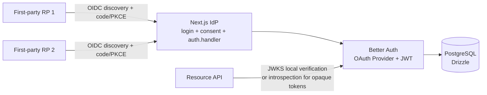

# White-label OIDC Identity Provider

A fullstack Next.js identity provider template built on Better Auth's OAuth 2.1 Provider plugin. Each deployment has one fixed visual brand: change `branding/config.ts`, replace `branding/assets/*`, supply deployment environment variables, seed first-party clients, and deploy.

## Architecture



The login pages and `auth.handler` share one origin. Do not split them into separate frontend and auth-server origins: signed `oauth_query` forwarding and session cookies depend on same-origin serving.

## Stack and layout

- `apps/web`: Next.js App Router, public IdP UI and `/api/auth/[...all]`.
- `apps/test-rp`: two-port OIDC relying-party verifier using `openid-client`; Playwright proof in `tests/sso.spec.ts`.
- `packages/auth`: Better Auth configuration, OAuth Provider, JWT, audit hooks, lockout policy.
- `packages/db`: PostgreSQL/Drizzle schema and Docker Compose.
- `branding`: only deployment-specific brand configuration, assets, and first-party client definitions.

## Local setup

Prerequisites: Bun 1.3+, Docker Desktop, and Node-compatible tooling.

```bash
bun install
cp apps/web/.env.example apps/web/.env
cp packages/db/.env.example packages/db/.env
# Fill every required value in both untracked files.
bun run db:start
bun run db:push
bun run dev:web
```

Open `http://localhost:3000`. The local issuer is `http://localhost:3000/api/auth`; discovery is `http://localhost:3000/api/auth/.well-known/openid-configuration`.

The Docker database maps host port 5433 to PostgreSQL 5432. `POSTGRES_PASSWORD` is required by Compose and is read only from the untracked `packages/db/.env` or the shell environment.

Health and handler smoke checks:

```bash
curl -i http://localhost:3000/api/health
curl -i http://localhost:3000/api/auth/ok
```

## Environment

`apps/web/.env.example` is the complete application variable list:

- `DATABASE_URL`, `BETTER_AUTH_SECRET`, `BETTER_AUTH_URL`, `CORS_ORIGIN`.
- `SEED_USER_NAME`, `SEED_USER_EMAIL`, `SEED_USER_PASSWORD` for local-only test data.
- `IDP_ADMIN_EMAIL`, `IDP_ADMIN_PASSWORD`, `OAUTH_ADMIN_EMAILS` for explicit operator provisioning.
- `OAUTH_VALID_AUDIENCES` for resource-server audiences.
- `OAUTH_ACCESS_TOKEN_PREFIX`, `OAUTH_REFRESH_TOKEN_PREFIX`, `OAUTH_CLIENT_SECRET_PREFIX`; set these before the first production deployment and treat them as immutable.
- `OAUTH_TRUSTED_CLIENT_IDS`; trusted clients are cached and locked against CRUD endpoint mutations.
- `OAUTH_PAIRWISE_SECRET` is optional and intentionally unset for the default public subject strategy. If enabled, it must be at least 32 characters and permanent.
- `TEST_DATABASE_ADMIN_URL`, `TEST_DATABASE_URL` are required only by the isolated protocol test runner and must target the disposable `*_test` database.

Never commit either `.env` file. Never place passwords, client secrets, signing keys, or token-bearing URLs in source or logs.

## Migrations and scripts

```bash
bun run db:push
bun run db:generate
bun run db:migrate
bun --cwd apps/web run seed:admin
bun --cwd apps/web run seed:user
bun --cwd apps/web run seed:clients
bun --cwd apps/web run clients list
bun --cwd apps/web run clients rotate <client_id>
bun --cwd apps/web run clients disable <client_id>
bun --cwd apps/web run clients enable <client_id>
bun --cwd apps/web run revoke-user <email>
```

`seed:admin` is deliberate and proves password ownership before assigning the server-only `admin` role. Public signup cannot set that role. `seed:clients` is idempotent by client name and prints a new client secret only at creation/rotation; store it immediately.

The OAuth Provider schema is generated from the installed auth config with the version-matched CLI:

```bash
bunx auth@1.6.23 generate --config packages/auth/src/index.ts --output packages/db/src/schema/auth.ts
```

## OAuth/OIDC endpoints

All endpoints are provided by the Better Auth plugin; no protocol or cryptography is hand-rolled.

- Authorization: `/api/auth/oauth2/authorize`
- Token: `/api/auth/oauth2/token`
- UserInfo: `/api/auth/oauth2/userinfo`
- JWKS: `/api/auth/jwks`
- Introspection: `/api/auth/oauth2/introspect`
- Revocation: `/api/auth/oauth2/revoke`
- RP logout: `/api/auth/oauth2/end-session`
- OIDC discovery: `/api/auth/.well-known/openid-configuration`
- RFC 8414 metadata: `/api/auth/.well-known/oauth-authorization-server`

OAuth defaults stay secure: authorization code only, PKCE S256 only, exact redirect URI matching, dynamic client registration disabled, and `openid` enabled.

## Registering a first-party app

1. Add one entry to `branding/clients.ts` with exact callback and post-logout URLs.
2. Ensure the operator is provisioned: `bun --cwd apps/web run seed:admin`.
3. Ensure the operator email is in `OAUTH_ADMIN_EMAILS`.
4. Run `bun --cwd apps/web run seed:clients`.
5. Store each newly printed `client_secret` in the relying party's secret manager.
6. Add stable trusted client IDs to `OAUTH_TRUSTED_CLIENT_IDS` only when you want plugin-level in-memory caching and CRUD locking.
7. Restart/redeploy after changing trusted-client configuration.

Public clients use `type: "public"` and `token_endpoint_auth_method: "none"`; PKCE remains mandatory. Do not use wildcards or prefix matching in redirect URIs.

## Verification

The protocol suite creates and destroys only `krazil_idp_test`:

```bash
bun --cwd apps/web run test
```

It covers authorization-code/token exchange, PKCE failure, bad redirect URI, expired code, refresh rotation, revocation, and introspection. The real browser verifier uses only localhost and provisions its configured test user idempotently:

```bash
cp apps/test-rp/.env.example apps/test-rp/.env
# Set E2E_RP1_CLIENT_ID/SECRET and E2E_RP2_CLIENT_ID/SECRET from the
# one-time output of the client seed command, plus TEST_RP_USER_EMAIL/PASSWORD.
bun --cwd apps/web run seed:admin
bun --cwd apps/web run seed:clients
bun --cwd apps/test-rp run test:e2e
```

The test setup creates the `TEST_RP_USER_*` account through the localhost IdP
when absent, or verifies its configured password when it already exists; it
never changes an existing user's password. Playwright starts the IdP and both
RP servers automatically. PostgreSQL must be running and the schema applied
first. See `INTEGRATION.md` for the flow and `RUNBOOK.md` for operations.

## Production notes

- HTTPS is mandatory in production. HSTS is emitted only when `NODE_ENV=production`.
- Better Auth global/per-endpoint rate limiting is enabled; OAuth endpoint defaults are per-IP and documented in the plugin source/docs.

Token lifetimes are explicit in `packages/auth/src/token-config.ts` and retain plugin defaults: access 1 hour, machine-to-machine 1 hour, ID token 10 hours, refresh 30 days, authorization code 10 minutes. High-privilege scopes belong in `SCOPE_EXPIRATIONS` with a shorter 5–15 minute value.

Access-token authorization modes are selected with `OAUTH_ACCESS_TOKEN_MODE`:

- `short-lived` (default): local JWKS verification; use short
  `scopeExpirations` values when a smaller stolen-token window is required.
- `hybrid`: local verification for normal traffic and a live session/user
  authorization check on high-risk resource routes.
- `immediate`: the same authoritative session/user check on every protected
  resource route. This immediately honors user/session termination, but it is
  not token-specific JWT revocation; `/oauth2/revoke` cannot un-issue an
  individual JWT in OAuth Provider 1.6.23.

If token-specific immediate revocation is required, use opaque access tokens
with database introspection in a fresh deployment or add a separately designed
`jti`/token-hash denylist. Do not switch existing hashed-client deployments to
`disableJwtPlugin` at runtime.

The private status check validates the verified token's `sid` and `sub` against
live Better Auth session state. It is authoritative for user/session
termination, not for an individual JWT's `/oauth2/revoke` status. It is not
OAuth introspection: OAuth Provider 1.6.23 can report a deleted-session JWT as
`active`. If a deployment instead needs database-backed opaque tokens, treat
`disableJwtPlugin` as a deliberate fresh-deployment migration, not a runtime
switch for existing clients.

OAuth endpoint limits are per-IP and reset after the window:

| Endpoint | Window | Max |
| --- | ---: | ---: |
| `/oauth2/token` | 60s | 20 |
| `/oauth2/authorize` | 60s | 30 |
| `/oauth2/introspect` | 60s | 100 |
| `/oauth2/revoke` | 60s | 30 |
| `/oauth2/register` | 60s | 5 |
| `/oauth2/userinfo` | 60s | 60 |

CSRF posture: Better Auth validates origins on state-changing requests, and the browser client sends same-origin, secure/httpOnly/same-site cookies in production. OAuth clients must generate and verify `state`; the provider verifies signed `oauth_query` and PKCE S256.
- The production mailer uses the provider-neutral `MAILER_WEBHOOK_URL`/`MAILER_WEBHOOK_TOKEN` environment variables and fails closed when the URL is absent; it never prints token URLs in production.
- Local JWT verification is fast but cannot revoke already-issued JWTs. The kill switch performs three distinct operations: deleting sessions blocks new browser authorization; explicitly marking refresh-token rows `revoked` blocks refresh grants; deleting opaque access-token rows makes those tokens inactive. Session deletion or OIDC end-session alone does **not** revoke refresh tokens in plugin 1.6.23. JWT introspection can remain `active` until JWT expiry even after its backing session is deleted; use short scope expirations or signing-key rotation for emergency JWT invalidation.
