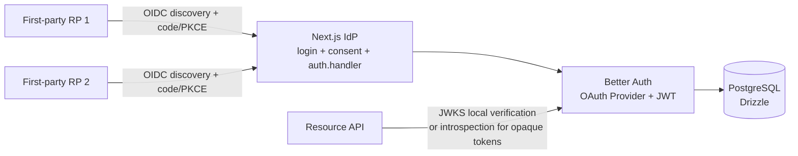

# White-label OIDC Identity Provider

A fullstack Next.js identity provider template built on Better Auth's OAuth 2.1 Provider plugin. Each deployment has one fixed visual brand: change `branding/config.ts`, replace `branding/assets/*`, supply deployment environment variables, seed first-party clients, and deploy.

## Architecture



The login pages and `auth.handler` share one origin. Do not split them into separate frontend and auth-server origins: signed `oauth_query` forwarding and session cookies depend on same-origin serving.

## Stack and layout

- `apps/web`: Next.js App Router, public IdP UI and `/api/auth/[...all]`.
- `apps/test-rp`: two-port OIDC relying-party verifier using `openid-client`; Playwright proof in `tests/sso.spec.ts`.
- `packages/auth`: Better Auth configuration, OAuth Provider, JWT, audit hooks, lockout policy.
- `packages/db`: PostgreSQL/Drizzle schema and Docker Compose.
- `packages/types`: `@krazil-idp/types`, the shared (npm-publishable, currently workspace-private) integration contract — token claim types, revocation-status API types, and zero-dependency runtime shape guards for relying parties and resource servers.
- `branding`: only deployment-specific brand configuration, assets, and first-party client definitions.

## Local setup

Prerequisites: Bun 1.3+, Docker Desktop, and Node-compatible tooling.

```bash
bun install
cp apps/web/.env.example apps/web/.env
cp packages/db/.env.example packages/db/.env
# Fill every required value in both untracked files.
bun run db:start
bun run db:push
bun run dev:web
```

Open `http://localhost:3000`. The local issuer is `http://localhost:3000/api/auth`; discovery is `http://localhost:3000/api/auth/.well-known/openid-configuration`.

The Docker database maps host port 5433 to PostgreSQL 5432. `POSTGRES_PASSWORD` is required by Compose and is read only from the untracked `packages/db/.env` or the shell environment.

Health and handler smoke checks:

```bash
curl -i http://localhost:3000/api/health
curl -i http://localhost:3000/api/auth/ok
```

## Environment

`apps/web/.env.example` is the complete application variable list:

- `DATABASE_URL`, `BETTER_AUTH_SECRET`, `BETTER_AUTH_URL`, `CORS_ORIGIN`.
- `REQUIRE_EMAIL_VERIFICATION` sends verification mail on signup and, when true, blocks unverified password sign-in.
- `TWO_FACTOR_ENABLED` controls only whether opt-in TOTP/backup-code enrollment UI is exposed. The two-factor server/client plugins are always mounted; setting this flag false does not bypass an already-enrolled account's challenge.
- `SEED_USER_NAME`, `SEED_USER_EMAIL`, `SEED_USER_PASSWORD` for local-only test data.
- `IDP_ADMIN_EMAIL`, `IDP_ADMIN_PASSWORD`, `OAUTH_ADMIN_EMAILS` for explicit operator provisioning.
- `OAUTH_VALID_AUDIENCES` for resource-server audiences.
- `OAUTH_ACCESS_TOKEN_PREFIX`, `OAUTH_REFRESH_TOKEN_PREFIX`, `OAUTH_CLIENT_SECRET_PREFIX`; set these before the first production deployment and treat them as immutable.
- `OAUTH_TRUSTED_CLIENT_IDS`; trusted clients are cached and locked against CRUD endpoint mutations.
- `OAUTH_PAIRWISE_SECRET` is optional and intentionally unset for the default public subject strategy. If enabled, it must be at least 32 characters and permanent.
- `TEST_DATABASE_ADMIN_URL`, `TEST_DATABASE_URL` are required only by the isolated protocol test runner and must target the disposable `*_test` database.

Never commit either `.env` file. Never place passwords, client secrets, signing keys, or token-bearing URLs in source or logs.

## Migrations and scripts

Two database workflows are supported and must not be mixed on one database:

- **Development** uses schema push (no migration bookkeeping):
  ```bash
  bun run db:push
  ```
- **Fresh deployments** apply the committed migration chain to an empty database:
  ```bash
  bun run db:migrate
  ```
- **Converting a push-managed database to migration-managed** requires a
  one-time baseline BEFORE the first `db:migrate`. Without it, `drizzle-kit
  migrate` replays `0000` onto existing tables and aborts with `relation "…"
  already exists`:
  ```bash
  bun run db:baseline   # marks committed migrations as already applied
  bun run db:migrate    # then applies only newer migrations
  ```

Regenerate a migration after a schema change with `bun run db:generate`.

Operator and client scripts:

```bash
bun --cwd apps/web run seed:admin
bun --cwd apps/web run seed:user
bun --cwd apps/web run seed:clients
bun --cwd apps/web run clients list
bun --cwd apps/web run clients rotate <client_id>
bun --cwd apps/web run clients disable <client_id>
bun --cwd apps/web run clients enable <client_id>
bun --cwd apps/web run revoke-user <email>
bun --cwd apps/web run revoke-token <jwt_access_token>
bun --cwd apps/web run set-role <email> <admin|moderator|user>
```

`seed:admin` is deliberate and proves password ownership before assigning the server-only `admin` role. Public signup cannot set any role. `seed:clients` is idempotent by client name and prints a new client secret only at creation/rotation; store it immediately.

### Operator roles

Role-based user administration is served by Better Auth's admin plugin under `/api/auth/admin/*`, with access control defined in `packages/auth/src/permissions.ts`:

- `admin`: full operator — the only role that may delete accounts, assign roles, change emails/passwords, manage sessions, or impersonate. OAuth client management additionally requires `OAUTH_ADMIN_EMAILS` membership.
- `moderator`: HR-style account lifecycle — create accounts (no extra `data` fields), list/read, update allowlisted profile fields (`name`, `image`), and enable/disable sign-in via ban/unban. Deliberately cannot delete accounts, change roles/emails/passwords, manage sessions, or impersonate, and can never ban, unban, or remove an account holding the `admin` role (enforced by a dedicated server guard). The exclusions are a deployment policy — adjust them in `packages/auth/src/permissions.ts` with the tradeoffs documented there.
- `user`: no operator permissions (default).

Ban enforcement is IdP-wide, not just session-deep: banning revokes the user's sessions, all OAuth refresh tokens, and opaque access tokens in one transaction, blocks completion of a pending 2FA challenge, and the token endpoint refuses to issue tokens to a banned subject on any grant (JWT and opaque alike). One caveat: **already-issued JWT access tokens remain valid until `exp` for relying parties that only verify locally** — hybrid/immediate resource servers reject them immediately because the ban deleted the session (see INTEGRATION.md). Use `revoke-token` for a specific outstanding JWT.

Assign roles with `bun --cwd apps/web run set-role <email> <role>` (refuses to demote the last admin) or, as an admin, via the `/admin/set-role` endpoint.

```bash
bun --cwd apps/web x auth@1.6.23 generate \
	--config ../../packages/auth/src/index.ts \
	--output ../../packages/db/src/schema/auth.ts --yes
```

## OAuth/OIDC endpoints

All endpoints are provided by the Better Auth plugin; no protocol or cryptography is hand-rolled.

- Authorization: `/api/auth/oauth2/authorize`
- Token: `/api/auth/oauth2/token`
- UserInfo: `/api/auth/oauth2/userinfo`
- JWKS: `/api/auth/jwks`
- Introspection: `/api/auth/oauth2/introspect`
- Revocation: `/api/auth/oauth2/revoke`
- RP logout: `/api/auth/oauth2/end-session`
- OIDC discovery: `/api/auth/.well-known/openid-configuration`
- RFC 8414 metadata: `/api/auth/.well-known/oauth-authorization-server`

OAuth defaults stay secure: authorization code only, PKCE S256 only, exact redirect URI matching, dynamic client registration disabled, and `openid` enabled.

## Registering a first-party app

1. Add one entry to `branding/clients.ts` with exact callback and post-logout URLs.
2. Ensure the operator is provisioned: `bun --cwd apps/web run seed:admin`.
3. Ensure the operator email is in `OAUTH_ADMIN_EMAILS`.
4. Run `bun --cwd apps/web run seed:clients`.
5. Store each newly printed `client_secret` in the relying party's secret manager.
6. Add stable trusted client IDs to `OAUTH_TRUSTED_CLIENT_IDS` only when you want plugin-level in-memory caching and CRUD locking.
7. Restart/redeploy after changing trusted-client configuration.

Public clients use `type: "public"` and `token_endpoint_auth_method: "none"`; PKCE remains mandatory. Do not use wildcards or prefix matching in redirect URIs.

## Verification

The protocol suite creates and destroys only `krazil_idp_test`:

```bash
bun --cwd apps/web run test
```

It covers authorization-code/token exchange, PKCE failure, bad redirect URI, expired code, refresh rotation, revocation, and introspection. The real browser verifier uses only localhost and provisions its configured test user idempotently:

```bash
cp apps/test-rp/.env.example apps/test-rp/.env
# Set E2E_RP1_CLIENT_ID/SECRET and E2E_RP2_CLIENT_ID/SECRET from the
# one-time output of the client seed command, plus TEST_RP_USER_EMAIL/PASSWORD.
bun --cwd apps/web run seed:admin
bun --cwd apps/web run seed:clients
bun --cwd apps/test-rp run test:e2e
```

The test setup creates the `TEST_RP_USER_*` account through the localhost IdP
when absent, or verifies its configured password when it already exists; it
never changes an existing user's password. Playwright starts the IdP and both
RP servers automatically. PostgreSQL must be running and the schema applied
first. See `INTEGRATION.md` for the flow and `RUNBOOK.md` for operations.

To exercise the opt-in 2FA continuation fixture, use a dedicated localhost database/account password of at least 12 characters and run:

```bash
TWO_FACTOR_ENABLED=true bun --cwd apps/test-rp run test:e2e
```

Enabled mode provisions a fresh disposable 2FA account, preserves the signed `oauth_query` through `/two-factor`, and proves RP1 and RP2 callbacks without another credential prompt. The default command keeps 2FA enrollment UI hidden and runs the existing smoke tests.

## Production notes

- HTTPS is mandatory in production. HSTS is emitted only when `NODE_ENV=production`.
- Better Auth global/per-endpoint rate limiting is enabled; OAuth endpoint defaults are per-IP and documented in the plugin source/docs.
- 2FA is single-tenant, user opt-in (TOTP + backup codes); organization/multi-tenant RBAC is not implied by this template.
- Rate-limit counters default to in-memory storage (`RATE_LIMIT_STORAGE=memory`), correct for a single instance. Set `RATE_LIMIT_STORAGE=database` before running more than one instance; the `rate_limit` table ships in migration `0003`. Production logs a warning while memory storage is active.
- Set `TRUSTED_PROXIES` to your reverse proxies' IPs/CIDRs so Better Auth only trusts `x-forwarded-for` values written by those hops. Leave it empty only when the proxy strips inbound forwarding headers.
- Production Content-Security-Policy is nonce-based and set per-request in `apps/web/src/proxy.ts` (`script-src 'self' 'nonce-…' 'strict-dynamic'`, no `'unsafe-inline'`). Development keeps a relaxed static CSP in `next.config.ts` for HMR.

Token lifetimes are explicit in `packages/auth/src/token-config.ts`: the
`short-lived` authorization-code mode uses 10 minutes, `hybrid` and
`immediate` use 1 hour with live authorization checks, machine-to-machine
tokens use 1 hour, ID tokens use 1 hour, refresh tokens 30 days, and
authorization codes 60 seconds. High-privilege scopes belong in
`SCOPE_EXPIRATIONS` with a shorter 5–15 minute value.

Access-token authorization modes are selected with `OAUTH_ACCESS_TOKEN_MODE`:

- `short-lived` (default): local JWKS verification with a 10-minute
  authorization-code access-token TTL. Machine tokens retain their one-hour
  configured TTL. A raw local verifier does not query the denylist, so a
  denylisted JWT remains usable there until expiry.
- `hybrid`: local verification for normal traffic and a live session/user
  authorization check on high-risk resource routes. Those routes can reject a
  denylisted JWT when the resource server forwards its verified `jti`.
- `immediate`: the same authoritative session/user check on every protected
  resource route, plus the same `jti` denylist check.

JWT-specific revocation is implemented without changing the OAuth Provider
response contract. For a valid JWT access token, `/oauth2/revoke` verifies the
signature, issuer, audience, and authenticated client's ownership of `azp`,
then stores the signed `jti` until expiry. Invalid, expired, or foreign JWTs
are not inserted. Database write failures are surfaced rather than reported as
successful revocations.

The repository pins a Bun patch for OAuth Provider `1.6.23` so JOSE token
validation failures reach RFC 7009's authenticated-client no-op response instead
of becoming HTTP 500. Remove that patch only after an upstream upgrade passes the
wrong-signature and failed-client-auth protocol tests.

The denylist is enforced by `/oauth2/introspect` and the private
`/token-revocation-status` endpoint. Resource servers must send the verified
JWT's `jti` in addition to `sid`/`sub` for user tokens or `azp` for machine
tokens. Raw JWKS verification cannot see this database state. The operator CLI
accepts one verified JWT and performs the same denylist insert:

```bash
bun --cwd apps/web run revoke-token <jwt_access_token>
```

The CLI is for a known single token and never prints the token. Use
`revoke-user` for the user-wide session, refresh-token, and opaque-token kill
switch; it does not enumerate already-issued JWTs. Signing-key rotation remains
the emergency operation for invalidating every outstanding JWT.

Machine-to-machine JWTs have no `sid`/`sub`; hybrid and immediate checks use
their verified `azp` to require a live, enabled OAuth client. Disabling that
client rejects all of its machine tokens at the next status check. Selecting
one individual machine JWT uses the signed `jti` denylist path above.

OAuth endpoint limits are per-IP and reset after the window:

| Endpoint | Window | Max |
| --- | ---: | ---: |
| `/oauth2/token` | 60s | 20 |
| `/oauth2/authorize` | 60s | 30 |
| `/oauth2/introspect` | 60s | 100 |
| `/oauth2/revoke` | 60s | 30 |
| `/oauth2/register` | 60s | 5 |
| `/oauth2/userinfo` | 60s | 60 |

CSRF posture: Better Auth validates origins on state-changing requests, and the browser client sends same-origin, secure/httpOnly/same-site cookies in production. OAuth clients must generate and verify `state`; the provider verifies signed `oauth_query` and PKCE S256.
- The production mailer sends over SMTP (`MAILER_SMTP_HOST`/`PORT`/`USER`/`PASS`, `MAILER_FROM`) via nodemailer — any provider works with no code change — and fails closed when host/from are absent. STARTTLS is required on non-465 ports so token-bearing links are never sent in plaintext, and it never logs token URLs in production.
- Local JWT verification is fast but cannot consult the database denylist. `revoke-token` invalidates one known JWT for introspection and status-aware resource servers; signing-key rotation remains the global emergency fallback. Session deletion or OIDC end-session alone does **not** revoke refresh tokens in plugin 1.6.23.
